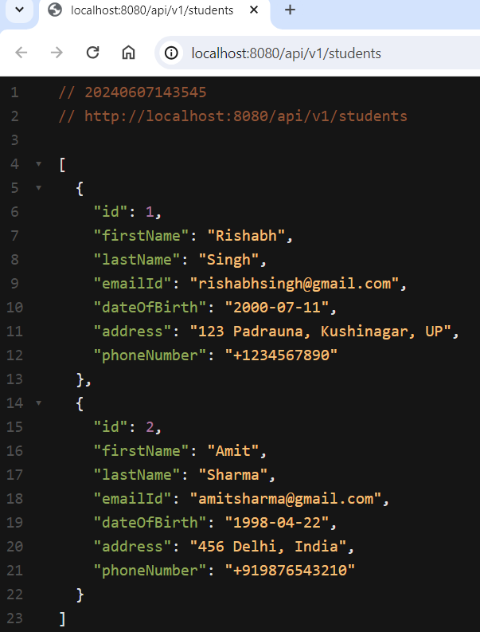
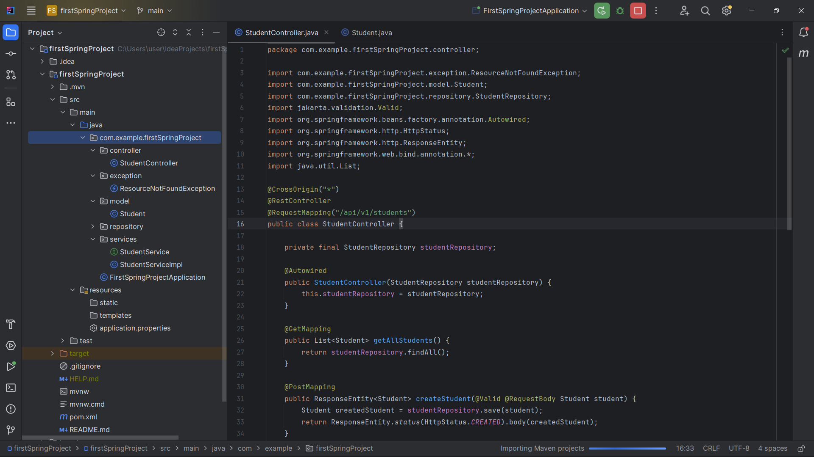

# firstSpringProject (Spring Boot CRUD Operation)

This repository contains a Spring Boot application that demonstrates simple CRUD (Create, Read, Update, Delete) operations with a `Student` entity.

## Features

- **Create**: Add new students to the database.
- **Read**: Retrieve and display information about students.
- **Update**: Modify existing student information.
- **Delete**: Remove students from the database.

## Technologies Used

- Spring Boot
- Spring Data JPA
- Hibernate
- MySQL
- Lombok

## Requirements

- Java 17 or higher
- Maven 3.8.1 or higher
- MySQL 8.0 or higher

## Getting Started

### Project Structure

```
  firstSpringProject
  │   ├── src
  │   │   ├── main
  │   │   │   ├── java
  │   │   │   │   └── com
  │   │   │   │       └── example
  │   │   │   │           └── firstSpringProject
  │   │   │   │               ├── controller
  │   │   │   │               │   └── StudentController.java
  │   │   │   │               ├── exception
  │   │   │   │               │   └── ResourceNotFoundException.java
  │   │   │   │               ├── model
  │   │   │   │               │   └── Student.java
  │   │   │   │               ├── repository
  │   │   │   │               │   └── StudentRepository.java (interface)
  │   │   │   │               ├── services
  │   │   │   │               │   ├── StudentService.java (interface)
  │   │   │   │               │   └── StudentServiceImpl.java
  │   │   │   │               └── FirstSpringProjectApplication.java
```

### Clone the Repository

```
  git clone git@github.com:itsindrajput/firstSpringProject.git
  cd spring-boot-crud-demo
```

### Configure the Database

Update the application.properties file located in src/main/resources with your MySQL database configuration:

```
  spring.application.name=firstSpringProject
  spring.datasource.url=jdbc:mysql://localhost:3306/studentsdb?allowPublicKeyRetrieval=true&useSSL=false&serverTimezone=UTC
  spring.datasource.username=root
  spring.datasource.password=root
  spring.jpa.properties.hibernate.dialect = org.hibernate.dialect.MySQLDialect
  spring.jpa.hibernate.ddl-auto = update
```

### Build and Run the Application

Use the following Maven command to build and run the application:

```
  mvn spring-boot:run
```

### API Endpoints

- POST /students: Create a new student.
- GET /students: Retrieve a list of all students.
- GET /students/{id}: Retrieve a specific student by ID.
- PUT /students/{id}: Update a student's information.
- DELETE /students/{id}: Delete a student.

## Contributing

Contributions are welcome! Please fork the repository and create a pull request with your changes.

## License

This project is licensed under the MIT License - see the LICENSE file for details.

## Output/Showcase

<p float="left">
  
   
</p>
<p> </p>
